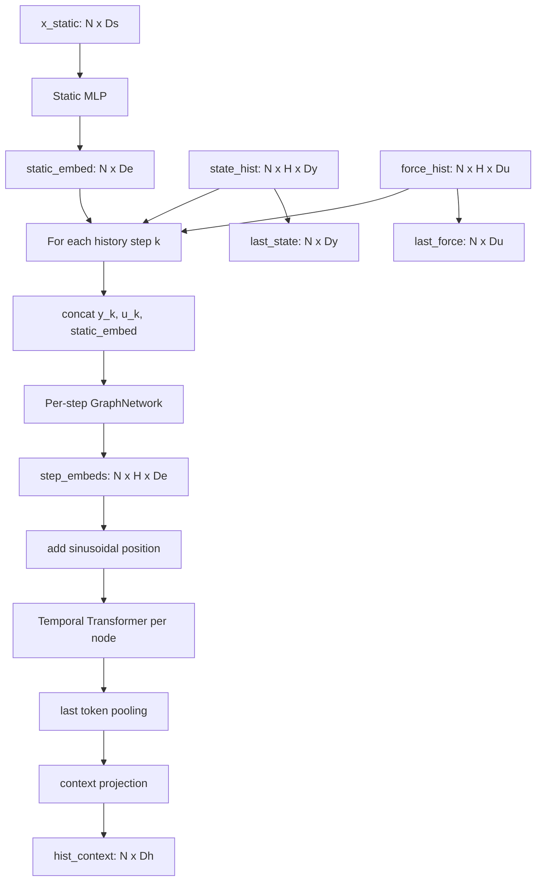

# NODE2 Network Architecture

> **Historical architecture snapshot.** The reference run and flags below
> predate the foundation repairs and are not current runtime instructions.
> See [Upgrade V1](upgrade_v1.md) for the supported history selector and fixed
> relative-time scale, and [the foundation report](foundation_correctness_repair.md)
> for current input and evaluation protocols.

Direct architecture reference for the implemented NODE2 model. This is written
to be easy to convert into a network plot. A TikZ/LaTeX version is saved in
`data_flow.tex`.

Source files:

- `models/node2_model.py`
- `models/encoders/history_encoder.py`
- `models/continuous/node_latent_block.py`
- `models/common/gnn_blocks.py`
- `configs/model_node2.yaml`
- `outputs/anuga_node2_h3_full_upgrade/config.json`

Reference run: `anuga_node2_h3_full_upgrade`.

Enabled architecture options:

```text
residual decoder     = on
history in ODE       = on
relative time in ODE = on
history encoder      = temporal Transformer
ODE method           = midpoint
forcing interpolation= hermite_cubic_backward
```

## Symbols

| Symbol | Meaning | ANUGA h3 value |
|---|---:|---:|
| `N` | total nodes in the PyG batch | mesh-dependent |
| `E` | directed graph edges in `edge_index` | mesh-dependent |
| `H` | history length | `3` |
| `F` | future rollout length | `64` |
| `K_eff` | sampled training horizon after optional curriculum cap | `8..F` |
| `D_s` | static feature channels | `4` |
| `D_u` | forcing channels | `1` |
| `D_y` | physical state channels | `3` |
| `D_e` | static/history embedding width | `96` |
| `D_h` | history context width | `96` |
| `D_z` | latent state width | `96` |

For ANUGA, the static features are `[x, y, elevation, friction]`, forcing is
rain rate, and the predicted state is `[depth, xmomentum, ymomentum]`.

## Architecture At A Glance

```text
Input PyG Data
  x_static     [N, 4]
  state_hist   [N, 3, 3]
  force_hist   [N, 3, 1]
  force_future [N, 64, 1]
  t_future     [64]
  edge_index   [2, E]

HistoryEncoder
  static_embed = StaticMLP(x_static)                         [N, 96]
  step_k       = GraphSAGE([state_hist_k, force_hist_k,
                            static_embed], edge_index)       [N, 96]
  step_embeds  = stack(step_1, step_2, step_3)                [N, 3, 96]
  tokens       = step_embeds + sinusoidal_position            [N, 3, 96]
  temporal_out = TransformerEncoder(tokens)                  [N, 3, 96]
  hist_context = last_token(temporal_out)                    [N, 96]
  last_state   = state_hist[:, -1, :]                        [N, 3]
  last_force   = force_hist[:, -1, :]                        [N, 1]

Latent initialization
  init_input = [hist_context, last_state, static_embed]       [N, 195]
  z0         = InitMLP(init_input)                            [N, 96]

Continuous forcing
  t_control = [0, t_future_1, ..., t_future_64]               [65]
  u_values  = [last_force, force_future]                     [N, 65, 1]
  u(t)      = CubicSpline(u_values, t_control).evaluate(t)   [N, 1]

Latent ODE, evaluated many times by torchdiffeq
  rel_t     = clamp(t / t_future[-1], 0, 1)                  [N, 1]
  ode_input = [z(t), u(t), static_embed, hist_context, rel_t] [N, 290]
  dz_dt     = GraphSAGE_ODE(ode_input, edge_index)            [N, 96]

ODE solve
  z_future = odeint(dz_dt, z0, [0, *t_future])[1:]            [N, 64, 96]

Decoder
  delta_y  = DecoderMLP(z_future)                            [N, 64, 3]
  y_hat    = last_state[:, None, :] + delta_y                 [N, 64, 3]
```

## Layer-Level Specification

| Module | Exact input | Layers | Output |
|---|---:|---|---:|
| Static MLP | `[N, 4]` | Linear `4->96`, GELU, Dropout `0.05`; Linear `96->96`, GELU, Dropout `0.05`; Linear `96->96` | `[N, 96]` |
| History step concat | `[N, 3]`, `[N, 1]`, `[N, 96]` | concatenate per history step | `[N, 100]` |
| History GraphSAGE | `[N, 100]`, `[2, E]` | SAGEConv `100->96`, GELU, Dropout `0.05`; SAGEConv `96->96` | `[N, 96]` |
| Temporal position | `[N, 3, 96]` | add sinusoidal PE along the history axis | `[N, 3, 96]` |
| Temporal Transformer | `[N, 3, 96]` | 2 x TransformerEncoderLayer, 4 heads, FFN `384`, dropout `0.05`, GELU | `[N, 3, 96]` |
| History pooling | `[N, 3, 96]` | last-token pooling; identity projection | `[N, 96]` |
| Init MLP | `[N, 195]` | Linear `195->96`, GELU; Linear `96->96` | `[N, 96]` |
| Forcing interpolant | `[N, 65, 1]`, `[65]` | Hermite cubic with backward differences | function `u(t): [N, 1]` |
| ODE input concat | `[N,96]`, `[N,1]`, `[N,96]`, `[N,96]`, `[N,1]` | concatenate at each ODE function call | `[N, 290]` |
| ODE GraphSAGE | `[N, 290]`, `[2, E]` | SAGEConv `290->96`, Softplus; SAGEConv `96->96` | `dz/dt [N, 96]` |
| ODE solver | `z0 [N,96]`, times `[65]` | `torchdiffeq.odeint`, method `midpoint` | `z_future [N,64,96]` |
| Decoder MLP | `[N,64,96]` | Linear `96->96`, GELU; Linear `96->96`, GELU; Linear `96->3` | `delta_y [N,64,3]` |
| Residual output | `delta_y`, `last_state` | broadcast add | `y_hat [N,64,3]` |

## Top-Level Flow

```mermaid
flowchart LR
    A[Trajectory file] --> B[Window sampler]
    B --> C[Normalized PyG Data]

    C --> D[HistoryEncoder]
    D -->|hist_context c| E[Init MLP]
    D -->|last_state y0| E
    D -->|static_embed s| E

    E -->|z0| F[torchdiffeq ODE solver]
    C -->|last_force and force_future| G[Forcing interpolant u(t)]
    C -->|t_future| G
    D -->|static_embed s| H[LatentNODEFunc]
    D -->|hist_context c| H
    G -->|u(t)| H
    C -->|edge_index G| H
    H -->|dz/dt| F

    F -->|z_future| I[MLP decoder]
    I -->|delta y_future| J[Residual add last_state]
    D -->|last_state y0| J
    J --> K[predicted future state]
```

## Input Window

`BaseTemporalGraphDataset.__getitem__` converts each trajectory into one
node-major graph sample:

| Field | Shape | Role |
|---|---:|---|
| `x_static` | `[N, D_s]` | per-node static geometry/material features |
| `state_hist` | `[N, H, D_y]` | known physical state history |
| `force_hist` | `[N, H, D_u]` | known forcing history |
| `force_future` | `[N, F, D_u]` | known future forcing used as NODE control |
| `y_future` | `[N, F, D_y]` | supervised target |
| `t_future` | `[1, F]` after collation/shared grid | normalized future solver times |
| `edge_index` | `[2, E]` | PyG graph connectivity |

Static, state, forcing, and targets are normalized before they reach the
model. `edge_attr` and `scenario_param` may exist on the data object, but
NODE2 currently does not consume them in `forward`.

## HistoryEncoder

The history encoder produces all context needed to initialize and condition
NODE2.



Layer details for the full upgraded h3 config:

| Block | Input | Main layers | Output |
|---|---:|---|---:|
| Static MLP | `[N, 4]` | MLP `4 -> 96 -> 96 -> 96`, GELU, dropout `0.05` | `static_embed [N, 96]` |
| Per-step GNN | `[N, 3 + 1 + 96]` | 2-layer GraphSAGE, hidden `96`, GELU/dropout between layers | `step_embed_k [N, 96]` |
| Temporal Transformer | `[N, H, 96]` | 2 encoder layers, 4 heads, FFN `384`, dropout `0.05`, batch first | `temporal_outputs [N, H, 96]` |
| History pooling | `[N, H, 96]` | last token pooling, then identity projection because `96 == D_h` | `hist_context [N, 96]` |

The Transformer is temporal-only: each node attends over its own `H` history
tokens. Spatial communication happens in the per-step GNN before the temporal
Transformer.

## Latent Initialization

NODE2 does not start the ODE from the physical state directly. It builds a
latent initial condition:

```text
init_inputs = concat(hist_context, last_state, static_embed)
            = [N, 96 + 3 + 96]
            = [N, 195]

z0 = init_mlp(init_inputs)
   = MLP 195 -> 96 -> 96
   = [N, D_z]
```

`z0` is the state integrated by the ODE solver.

## Forcing Interpolation

Future forcing is known at discrete future output times. NODE2 builds a
continuous control object so the ODE function can query forcing at intermediate
solver times:

```text
t_control = concat(0, t_future)           # [F + 1]
u_values  = concat(last_force, force_future)
          = [N, F + 1, D_u]
control   = CubicSpline or LinearInterpolation(u_values, t_control)
```

The h3 runs use `hermite_cubic_backward`, so `control.evaluate(t)` returns
`u(t): [N, D_u]`.

## Latent ODE Dynamics

During every ODE function evaluation, `LatentNODEFunc.forward(t, z)` builds a
node feature matrix and applies a graph network:

```text
rel_t = clamp(t / t_future[-1], 0, 1)       # [N, 1]
input = concat(z, u(t), static_embed, hist_context, rel_t)
      = [N, 96 + 1 + 96 + 96 + 1]
      = [N, 290]

dz_dt = GraphNetwork(input, edge_index)
      = 2-layer GraphSAGE, hidden 96, Softplus between layers
      = [N, 96]
```

ODE context is set once before integration:

| Context item | Source | Used for |
|---|---|---|
| `edge_index` | data graph | message passing in latent derivative |
| `static_embed` | HistoryEncoder | static conditioning at every ODE eval |
| `control` | forcing interpolant | `u(t)` at arbitrary solver times |
| `hist_context` | HistoryEncoder | history-aware latent dynamics |
| `time_scale` | final requested future time | normalized relative-time channel |

The ODE solver integrates:

```text
integration_times = [0, *t_future]          # length F + 1
rollout = odeint(LatentNODEFunc, z0, integration_times)
z_future = rollout[1:].permute(1, 0, 2)     # [N, F, 96]
```

The configured solver is `midpoint` with `rtol=1e-4`, `atol=1e-5`, and
`use_adjoint=false`.

## Decoder And Output

The decoder maps each future latent node state back to physical state space:

```text
decoded_delta = MLPDecoder(z_future)
              = MLP 96 -> 96 -> 96 -> 3
              = [N, F, D_y]

prediction = last_state[:, None, :] + decoded_delta
           = [N, F, D_y]
```

Because `use_residual_decoder=true` in the full upgraded run, the decoder
predicts a normalized-space delta from the last observed state. The returned
prediction is compared to normalized `y_future`.

During training, `F` is the future tensor length stored in the sample, while
`K_eff` is the effective horizon used for that step. The shared trainer first
applies `training.train_horizon_curriculum` to resolve the epoch-local maximum
horizon, samples `K_eff` from `train_horizon_min..current_train_horizon_max`,
then truncates `force_future`, `t_future`, and `y_future` before model forward.
The same mechanism is used for ANUGA and ISSM.

## Diagram-Ready Component List

| ID | Component | Inputs | Outputs | Plot note |
|---|---|---|---|---|
| 1 | Window sampler and normalizer | raw trajectory arrays | normalized PyG sample | show outside model boundary |
| 2 | Static MLP | `x_static` | `static_embed` | per-node static branch |
| 3 | History per-step concatenation | `state_hist[k]`, `force_hist[k]`, `static_embed` | history step features | repeated for `k=1..H` |
| 4 | Per-step GraphSAGE | step features, `edge_index` | `step_embeds` | spatial message passing |
| 5 | Positional encoding | `step_embeds` | temporal tokens | optional but on in h3 full |
| 6 | Temporal Transformer | temporal tokens | temporal outputs | attention along history only |
| 7 | History pooling | temporal outputs | `hist_context` | last-token pooling |
| 8 | Init MLP | `hist_context`, `last_state`, `static_embed` | `z0` | latent initial condition |
| 9 | Forcing interpolant | `last_force`, `force_future`, `t_future` | `u(t)` | external continuous control |
| 10 | LatentNODEFunc GraphSAGE | `z`, `u(t)`, `static_embed`, `hist_context`, `rel_t`, `edge_index` | `dz/dt` | ODE vector field |
| 11 | ODE solver | `z0`, `dz/dt`, times | `z_future` | continuous latent rollout |
| 12 | MLP decoder | `z_future` | state delta | nodewise decoder |
| 13 | Residual add | state delta, `last_state` | `y_hat_future` | final normalized prediction |

## Ablation Notes

The open `anuga_node2_h3_transformer_only` run uses the same Transformer
HistoryEncoder, latent initialization, forcing interpolation, ODE solver, and
decoder MLP, but disables three full-upgrade inputs:

| Flag | Full upgrade | Transformer-only |
|---|---:|---:|
| `use_residual_decoder` | `true` | `false` |
| `use_history_in_ode` | `true` | `false` |
| `use_relative_time` | `true` | `false` |
| `use_transformer_history` | `true` | `true` |

For that ablation, the ODE input is:

```text
input = concat(z, u(t), static_embed)
      = [N, 96 + 1 + 96]
      = [N, 193]
```

and the decoder output is used directly as `y_hat_future` rather than being
added to `last_state`.
